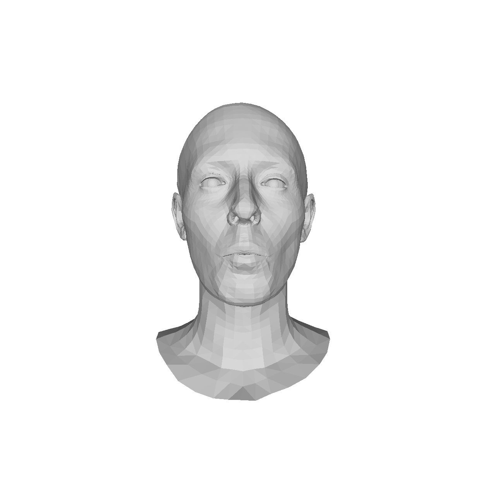
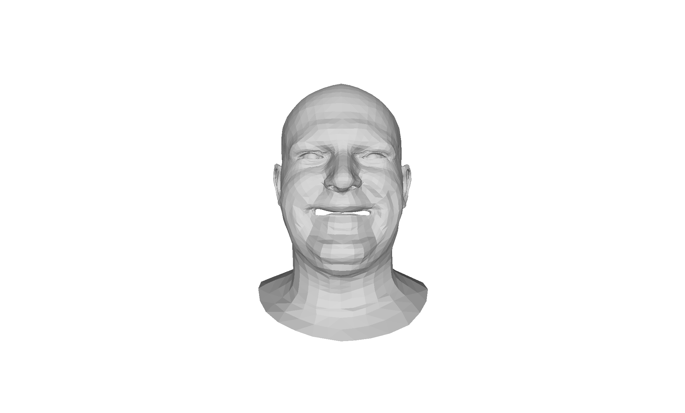
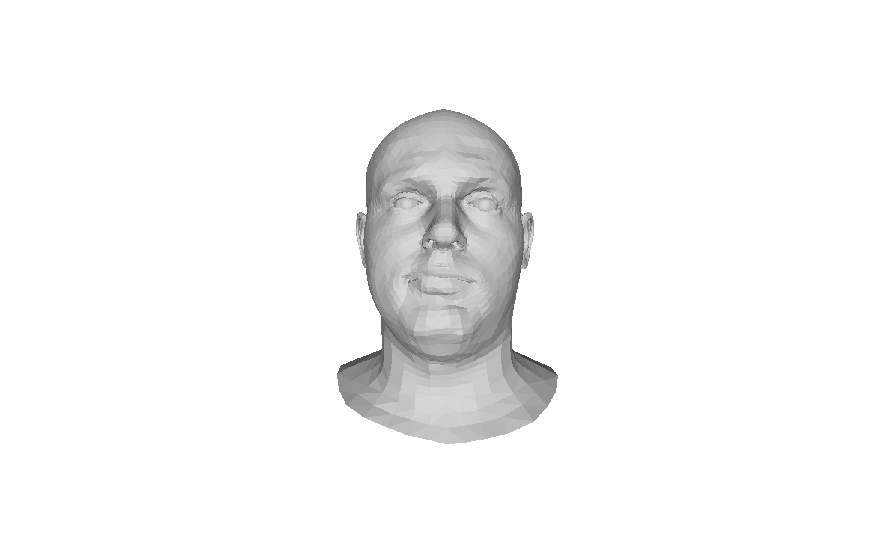
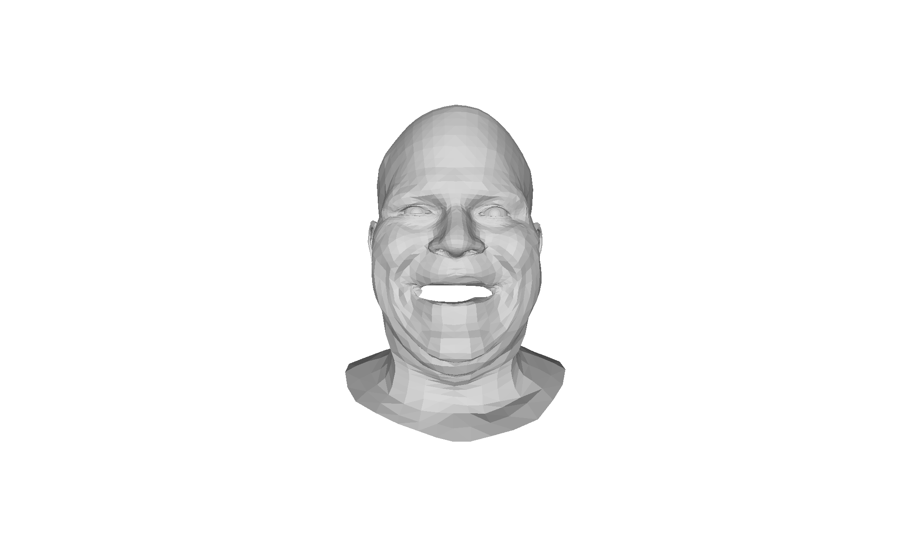
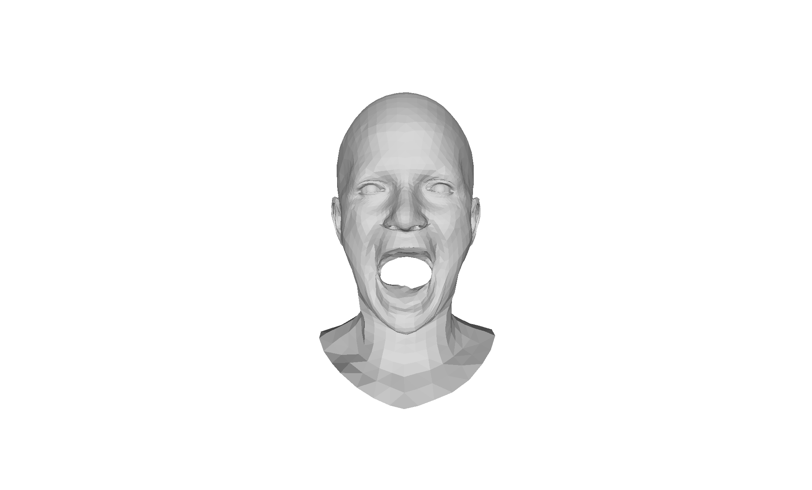
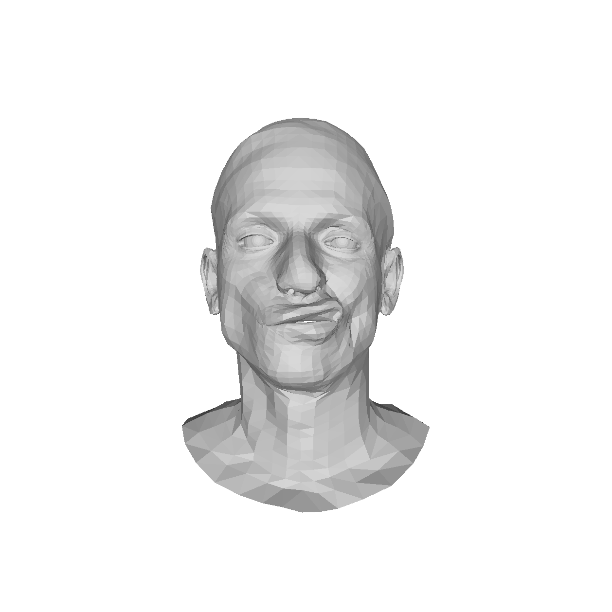
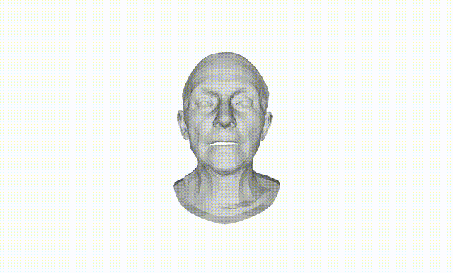
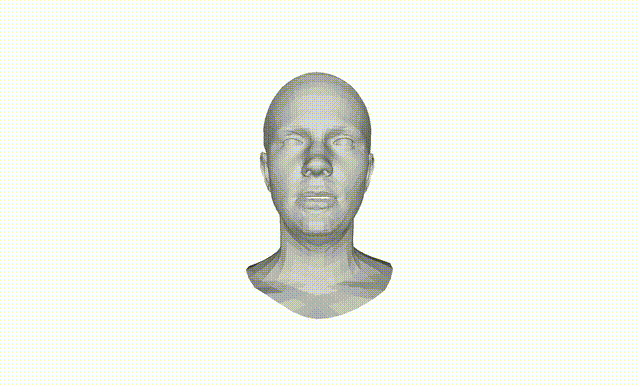
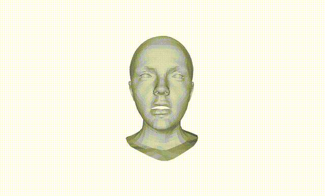
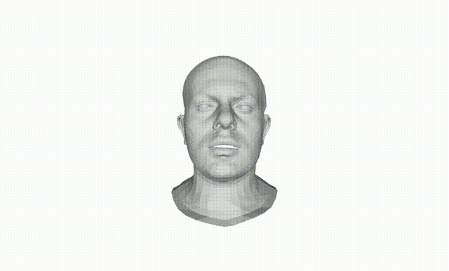

# FEKSS
本实验用于测试是否在一段面部视频中混入某个表情！

# 原始视频
|     |     |     |
|-----|-----|-----|
|  |   |     |
|  |  |  |
|  |  |     |

## sentence 01

 

## sentence 02

 

## sentence 03

 

## sentence 04

 

## sentence 05

 

