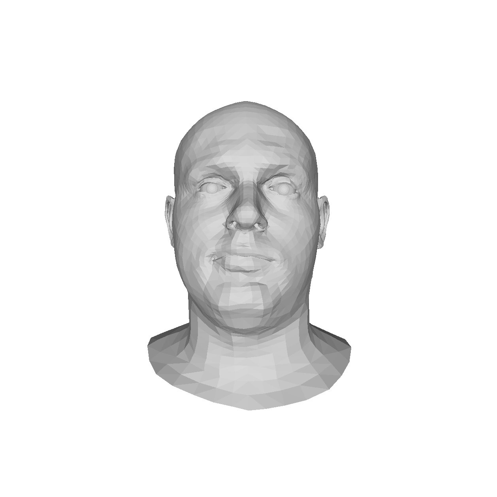
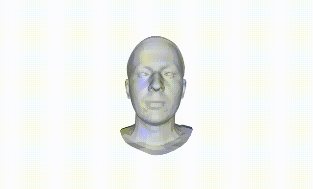

# FEKSS
本实验用于测试是否在一段面部视频中混入某个表情！

# 原始视频
|     |     |     |
|-----|-----|-----|
|| ||
||||
|||     |

## 测试1

|     |     |     |     |
|-----|-----|-----|-----|
|| ||  
这是原始视频
|
|||| 
这是经过编辑的视频
|
|||     |     |

## 测试2

|     |     |     |     |
|-----|-----|-----|-----|
|| ||  
这是原始视频
|
|||| 
这是经过编辑的视频
|
|||     |     |

## 测试3

|     |     |     |     |
|-----|-----|-----|-----|
|| ||  
这是原始视频
|
|||| 
这是经过编辑的视频
|
|||     |     |

## 测试4

|     |     |     |     |
|-----|-----|-----|-----|
|| ||  
这是原始视频
|
|||| 
这是经过编辑的视频
|
|||     |     |

## 测试5

|     |     |     |     |
|-----|-----|-----|-----|
|| ||  
这是原始视频
|
|||| 
这是经过编辑的视频
|
|||     |     |

## 测试6

|     |     |     |     |
|-----|-----|-----|-----|
|| ||  
这是原始视频
|
|||| 
这是经过编辑的视频
|
|||     |     |

## 测试7

|     |     |     |     |
|-----|-----|-----|-----|
|| ||  
这是原始视频
|
|||| 
这是经过编辑的视频
|
|||     |     |

## 测试8

|     |     |     |     |
|-----|-----|-----|-----|
|| ||  
这是原始视频
|
|||| 
这是经过编辑的视频
|
|||     |     |

## 测试9

|     |     |     |     |
|-----|-----|-----|-----|
|| ||  
这是原始视频
|
|||| 
这是经过编辑的视频
|
|||     |     |

## 测试10

|     |     |     |     |
|-----|-----|-----|-----|
|| ||  
这是原始视频
|
|||| 
这是经过编辑的视频
|
|||     |     |

## 测试11

|     |     |     |     |
|-----|-----|-----|-----|
|| ||  
这是原始视频
|
|||| 
这是经过编辑的视频
|
|||     |     |

## 测试12

|     |     |     |     |
|-----|-----|-----|-----|
|| ||  
这是原始视频
|
|||| 
这是经过编辑的视频
|
|||     |     |

## 测试13

|     |     |     |     |
|-----|-----|-----|-----|
|| ||  
这是原始视频
|
|||| 
这是经过编辑的视频
|
|||     |     |

## 测试14

|     |     |     |     |
|-----|-----|-----|-----|
|| ||  
这是原始视频
|
|||| 
这是经过编辑的视频
|
|||     |     |

## 测试15

|     |     |     |     |
|-----|-----|-----|-----|
|| ||  
这是原始视频
|
|||| 
这是经过编辑的视频
|
|||     |     |

## 测试16

|     |     |     |     |
|-----|-----|-----|-----|
|| ||  
这是原始视频
|
|||| 
这是经过编辑的视频
|
|||     |     |
