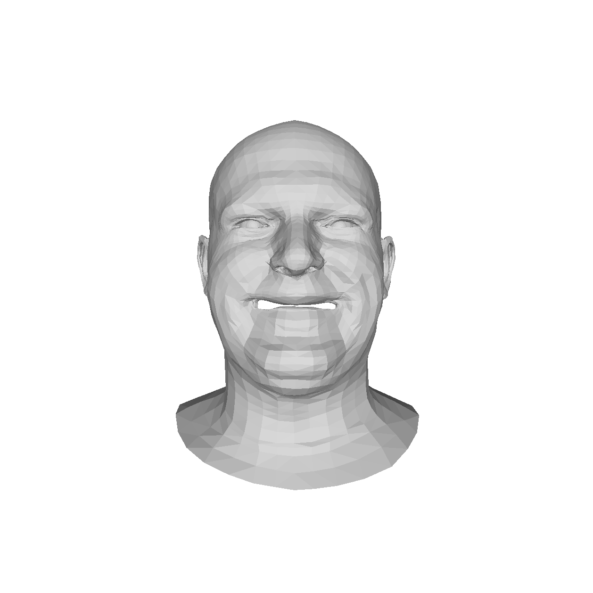
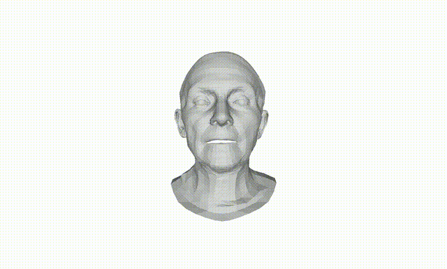

# FEKSS
本实验用于测试是否在一段面部视频中混入某个表情！

# 准备混入动画中的表情
|     |     |     |
|-----|-----|-----|
|| ||
||||
||      |     |

## 测试5

|     |     |     |     |
|-----|-----|-----|-----|
|| ||  
这是原始视频
|
|||| 
这是经过编辑的视频
|
||     |     |     |

## 测试1

|     |     |     |     |
|-----|-----|-----|-----|
|| ||  
这是原始视频
|
|||| 
这是经过编辑的视频
|
||    |     |

## 测试3

|     |     |     |     |
|-----|-----|-----|-----|
|| ||  
这是原始视频
|
|||| 
这是经过编辑的视频
|
||     |     |     |

## 测试1

|     |     |     |     |
|-----|-----|-----|-----|
|| ||  
这是原始视频
|
|||| 
这是经过编辑的视频
|
||     |     |     |

## 测试4

|     |     |     |     |
|-----|-----|-----|-----|
|| ||  
这是原始视频
|
|||| 
这是经过编辑的视频
|
||     |     |     |

## 测试5

|     |     |     |     |
|-----|-----|-----|-----|
|| ||  
这是原始视频
|
|||| 
这是经过编辑的视频
|
||     |     |     |

## 测试6

|     |     |     |     |
|-----|-----|-----|-----|
|| ||  
这是原始视频
|
|||| 
这是经过编辑的视频
|
||     |     |     |

## 测试4

|     |     |     |     |
|-----|-----|-----|-----|
|| ||  
这是原始视频
|
|||| 
这是经过编辑的视频
|
||     |     |     |

## 测试3

|     |     |     |     |
|-----|-----|-----|-----|
|| ||  
这是原始视频
|
|||| 
这是经过编辑的视频
|
||     |     |     |

## 测试4

|     |     |     |     |
|-----|-----|-----|-----|
|| ||  
这是原始视频
|
|||| 
这是经过编辑的视频
|
||     |     |     |

## 测试5

|     |     |     |     |
|-----|-----|-----|-----|
|| ||  
这是原始视频
|
|||| 
这是经过编辑的视频
|
||     |     |     |

## 测试6

|     |     |     |     |
|-----|-----|-----|-----|
|| ||  
这是原始视频
|
|||| 
这是经过编辑的视频
|
||     |     |     |

## 测试1

|     |     |     |     |
|-----|-----|-----|-----|
|| ||  
这是原始视频
|
|||| 
这是经过编辑的视频
|
||     |     |     |

## 测试1

|     |     |     |     |
|-----|-----|-----|-----|
|| ||  
这是原始视频
|
|||| 
这是经过编辑的视频
|
||     |     |     |

## 测试3

|     |     |     |     |
|-----|-----|-----|-----|
|| ||  
这是原始视频
|
|||| 
这是经过编辑的视频
|
||     |     |     |

## 测试5

|     |     |     |     |
|-----|-----|-----|-----|
|| ||  
这是原始视频
|
|||| 
这是经过编辑的视频
|
||     |     |     |

## 测试4

|     |     |     |     |
|-----|-----|-----|-----|
|| ||  
这是原始视频
|
|||| 
这是经过编辑的视频
|
||     |     |     |

## 测试5

|     |     |     |     |
|-----|-----|-----|-----|
|| ||  
这是原始视频
|
|||| 
这是经过编辑的视频
|
||     |     |     |

## 测试3

|     |     |     |     |
|-----|-----|-----|-----|
|| ||  
这是原始视频
|
|||| 
这是经过编辑的视频
|
||     |     |     |

## 测试6

|     |     |     |     |
|-----|-----|-----|-----|
|| ||  
这是原始视频
|
|||| 
这是经过编辑的视频
|
||     |     |     |

## 测试1

|     |     |     |     |
|-----|-----|-----|-----|
|| ||  
这是原始视频
|
|||| 
这是经过编辑的视频
|
||     |     |     |

## 测试4

|     |     |     |     |
|-----|-----|-----|-----|
|| ||  
这是原始视频
|
|||| 
这是经过编辑的视频
|
||     |     |     |

## 测试6

|     |     |     |     |
|-----|-----|-----|-----|
|| ||  
这是原始视频
|
|||| 
这是经过编辑的视频
|
||     |     |     |

## 测试3

|     |     |     |     |
|-----|-----|-----|-----|
|| ||  
这是原始视频
|
|||| 
这是经过编辑的视频
|
||     |     |     |

## 测试6

|     |     |     |     |
|-----|-----|-----|-----|
|| ||  
这是原始视频
|
|||| 
这是经过编辑的视频
|
||     |     |     |

