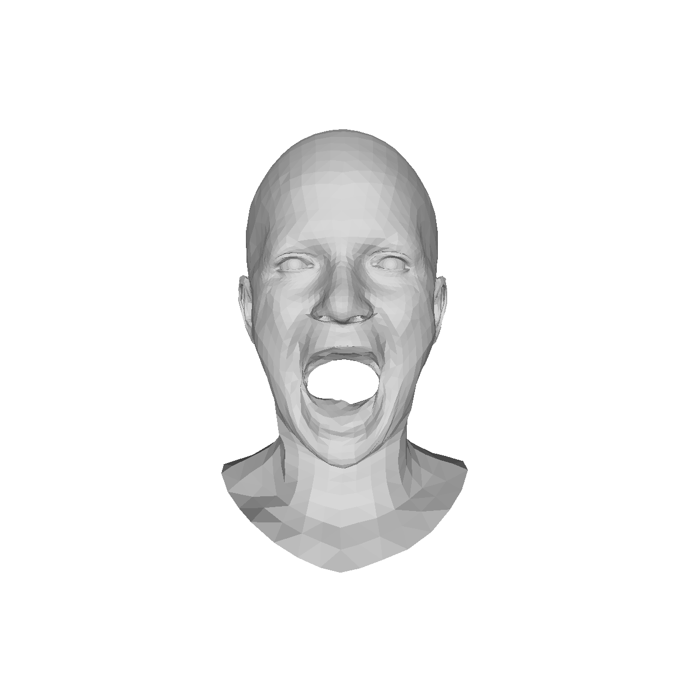
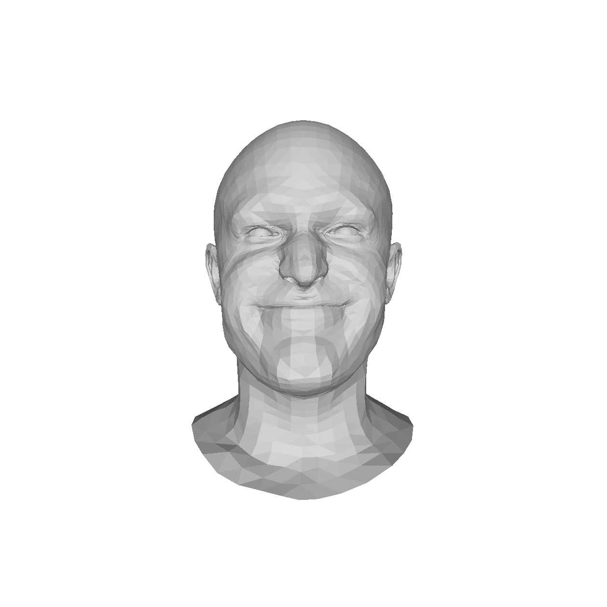
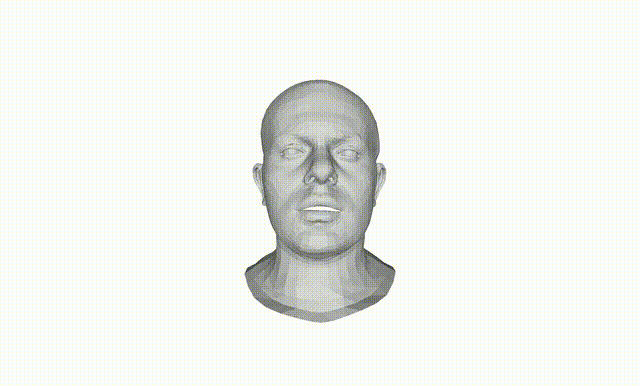
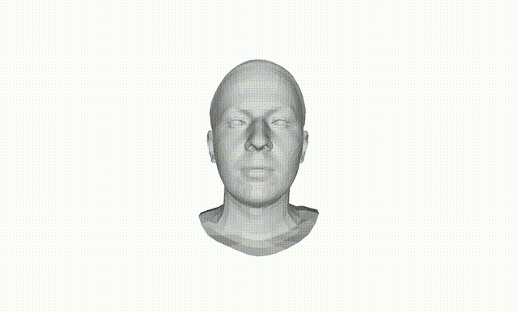
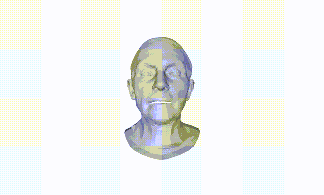
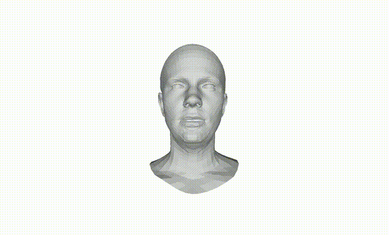
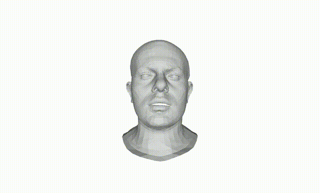
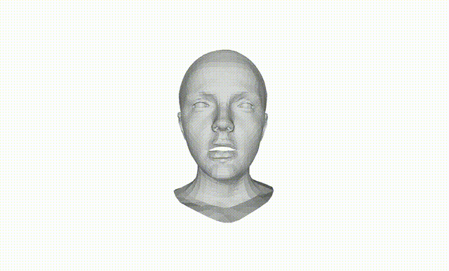

# FEKSS
本实验用于测试是否在一段面部视频中混入某个表情！本实验在一段语音视频中的中间片段（20%-80%）帧中混入了某一个表情，请在https://www.wjx.cn/vm/PWtcZ1s.aspx# 中对应的题目中选择对应的表情。本实验的结果保密，且仅用于该实验。

# 准备混入动画中的表情
|     |     |     |
|-----|-----|-----|
| 
A.cheeks_in
|  
B.mouth_side
| 
C.mouth_up
|
| 
D.high_smile
| 
E.lips_back
| 
F.mouth_down
|

这里的表情动画仅提供展示，混入的表情是这些动画的峰值表情，并展示在每个测试的左侧。

## 测试1

|     |     |     |     |
|-----|-----|-----|-----|
|
A
| 
B
|
C
|  
这是原始视频
|
|
D
|
E
|
F
| 
这是经过编辑的视频
|

## 测试2

|     |     |     |     |
|-----|-----|-----|-----|
|
A
| 
B
|
C
|  
这是原始视频
|
|
D
|
E
|
F
| 
这是经过编辑的视频
|

## 测试3

|     |     |     |     |
|-----|-----|-----|-----|
|
A
| 
B
|
C
|  
这是原始视频
|
|
D
|
E
|
F
| 
这是经过编辑的视频
|

## 测试4

|     |     |     |     |
|-----|-----|-----|-----|
|
A
| 
B
|
C
|  
这是原始视频
|
|
D
|
E
|
F
| 
这是经过编辑的视频
|

## 测试5
|     |     |     |     |
|-----|-----|-----|-----|
|
A
| 
B
|
C
|  
这是原始视频
|
|
D
|
E
|
F
| 
这是经过编辑的视频
|

## 测试6

|     |     |     |     |
|-----|-----|-----|-----|
|
A
| 
B
|
C
|  
这是原始视频
|
|
D
|
E
|
F
| 
这是经过编辑的视频
|

## 测试7

|     |     |     |     |
|-----|-----|-----|-----|
|
A
| 
B
|
C
|  
这是原始视频
|
|
D
|
E
|
F
| 
这是经过编辑的视频
|

## 测试8

|     |     |     |     |
|-----|-----|-----|-----|
|
A
| 
B
|
C
|  
这是原始视频
|
|
D
|
E
|
F
| 
这是经过编辑的视频
|

## 测试9

|     |     |     |     |
|-----|-----|-----|-----|
|
A
| 
B
|
C
|  
这是原始视频
|
|
D
|
E
|
F
| 
这是经过编辑的视频
|

## 测试10

|     |     |     |     |
|-----|-----|-----|-----|
|
A
| 
B
|
C
|  
这是原始视频
|
|
D
|
E
|
F
| 
这是经过编辑的视频
|

## 测试11

|     |     |     |     |
|-----|-----|-----|-----|
|
A
| 
B
|
C
|  
这是原始视频
|
|
D
|
E
|
F
| 
这是经过编辑的视频
|

## 测试12

|     |     |     |     |
|-----|-----|-----|-----|
|
A
| 
B
|
C
|  
这是原始视频
|
|
D
|
E
|
F
| 
这是经过编辑的视频
|

## 测试13

|     |     |     |     |
|-----|-----|-----|-----|
|
A
| 
B
|
C
|  
这是原始视频
|
|
D
|
E
|
F
| 
这是经过编辑的视频
|

## 测试14

|     |     |     |     |
|-----|-----|-----|-----|
|
A
| 
B
|
C
|  
这是原始视频
|
|
D
|
E
|
F
| 
这是经过编辑的视频
|

## 测试15

|     |     |     |     |
|-----|-----|-----|-----|
|
A
| 
B
|
C
|  
这是原始视频
|
|
D
|
E
|
F
| 
这是经过编辑的视频
|

## 测试16

|     |     |     |     |
|-----|-----|-----|-----|
|
A
| 
B
|
C
|  
这是原始视频
|
|
D
|
E
|
F
| 
这是经过编辑的视频
|

## 测试17

|     |     |     |     |
|-----|-----|-----|-----|
|
A
| 
B
|
C
|  
这是原始视频
|
|
D
|
E
|
F
| 
这是经过编辑的视频
|

## 测试18

|     |     |     |     |
|-----|-----|-----|-----|
|
A
| 
B
|
C
|  
这是原始视频
|
|
D
|
E
|
F
| 
这是经过编辑的视频
|

## 测试19

|     |     |     |     |
|-----|-----|-----|-----|
|
A
| 
B
|
C
|  
这是原始视频
|
|
D
|
E
|
F
| 
这是经过编辑的视频
|

## 测试20

|     |     |     |     |
|-----|-----|-----|-----|
|
A
| 
B
|
C
|  
这是原始视频
|
|
D
|
E
|
F
| 
这是经过编辑的视频
|

## 测试21

|     |     |     |     |
|-----|-----|-----|-----|
|
A
| 
B
|
C
|  
这是原始视频
|
|
D
|
E
|
F
| 
这是经过编辑的视频
|

## 测试22

|     |     |     |     |
|-----|-----|-----|-----|
|
A
| 
B
|
C
|  
这是原始视频
|
|
D
|
E
|
F
| 
这是经过编辑的视频
|

## 测试23

|     |     |     |     |
|-----|-----|-----|-----|
|
A
| 
B
|
C
|  
这是原始视频
|
|
D
|
E
|
F
| 
这是经过编辑的视频
|

## 测试24

|     |     |     |     |
|-----|-----|-----|-----|
|
A
| 
B
|
C
|  
这是原始视频
|
|
D
|
E
|
F
| 
这是经过编辑的视频
|

## 测试25

|     |     |     |     |
|-----|-----|-----|-----|
|
A
| 
B
|
C
|  
这是原始视频
|
|
D
|
E
|
F
| 
这是经过编辑的视频
|

